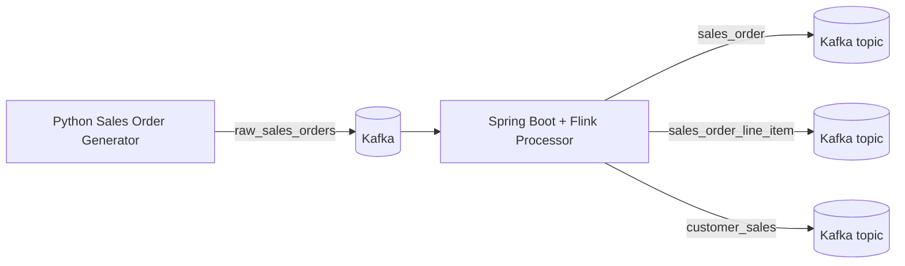

# Kafka Flink with Helm and Argo CD

This repository contains a complete realtime sales pipeline with these runtime components:

- A Python sales order generator continuously publishing composite order events to the `raw_sales_orders` Kafka topic.
- A Spring Boot Java application that starts an Apache Flink DataStream job, consumes `raw_sales_orders`, and fans out the stream into the Kafka topics `sales_order`, `sales_order_line_item`, and `customer_sales`.
- Local Docker development with Kafka and Kafka UI.
- Kubernetes deployment with Helm and Argo CD for `dev`, `qa`, and `prd` environments.

## Event Flow



## Repository Layout

- `producer`: Python Kafka producer for composite sales orders.
- `processor`: Spring Boot application that launches the Flink topology.
- `charts/realtime-app`: Helm chart for producer, processor, and optional Kafka.
- `environments`: Helm values for `dev`, `qa`, and `prd`.
- `argocd`: Argo CD Application manifests.
- `scripts`: Local bootstrap and image build helpers.

## Local Docker Development

Start Kafka, create the required topics, and run both applications:

```bash
docker compose up --build
```

Once the stack is running:

- Kafka is exposed on `localhost:9094`
- Kafka UI is exposed on `http://localhost:8080`
- The producer writes composite order events into `raw_sales_orders`
- The processor fans out records into `sales_order`, `sales_order_line_item`, and `customer_sales`

Inspect the Kafka topics from the running local stack:

```bash
./scripts/list-topics.sh
./scripts/consume-topic.sh raw_sales_orders 3
./scripts/check-pipeline-topics.sh
```

## Local Kubernetes Development with kind and Argo CD

1. Create a kind cluster and install Argo CD:

   ```bash
   ./scripts/bootstrap-kind.sh
   ```

2. Build the local images and load them into kind:

   ```bash
   ./scripts/build-images.sh
   ```

3. Update the `repoURL` fields in `argocd/dev.yaml`, `argocd/qa.yaml`, and `argocd/prd.yaml` to point to your Git repository.

4. Apply the Argo CD application for development:

   ```bash
   kubectl apply -f argocd/dev.yaml
   ```

5. Verify that Argo CD syncs the Helm chart and creates the `realtime-dev` namespace.

The `dev` environment enables the bundled Bitnami Kafka dependency and assumes the images are already loaded into the kind cluster with `imagePullPolicy: Never`.

## Environment Strategy

- `dev`: Local kind deployment with in-cluster Kafka from the Helm dependency.
- `qa`: GitOps deployment against a shared Kafka bootstrap service and registry-hosted images.
- `prd`: Same logical topology as `qa` with higher replica counts and faster Flink checkpoints.

## Configuration

### Producer

- `KAFKA_BOOTSTRAP_SERVERS`: Kafka bootstrap servers.
- `RAW_TOPIC`: Source topic name. Default is `raw_sales_orders`.
- `PRODUCER_INTERVAL_MS`: Publish interval in milliseconds.

### Processor

- `KAFKA_BOOTSTRAP_SERVERS`: Kafka bootstrap servers.
- `APP_RAW_SALES_ORDERS_TOPIC`: Source topic.
- `APP_SALES_ORDER_TOPIC`: Sink topic for order headers.
- `APP_SALES_ORDER_LINE_ITEM_TOPIC`: Sink topic for order line items.
- `APP_CUSTOMER_SALES_TOPIC`: Sink topic for per-customer aggregates.
- `APP_CONSUMER_GROUP_ID`: Kafka consumer group.
- `APP_CHECKPOINT_INTERVAL_MS`: Flink checkpoint interval.

## Build Commands

Build the Java processor jar:

```bash
cd processor
mvn -DskipTests package
```

Run the producer directly:

```bash
cd producer
uv sync
uv run producer
```

## Notes

- The Argo CD manifests intentionally use placeholder Git repo URLs and should be updated before applying.
- `qa` and `prd` values assume Kafka already exists and is reachable at the configured bootstrap service address.
- The Flink job is embedded in the Spring Boot process for a simple local and GitOps deployment model.
