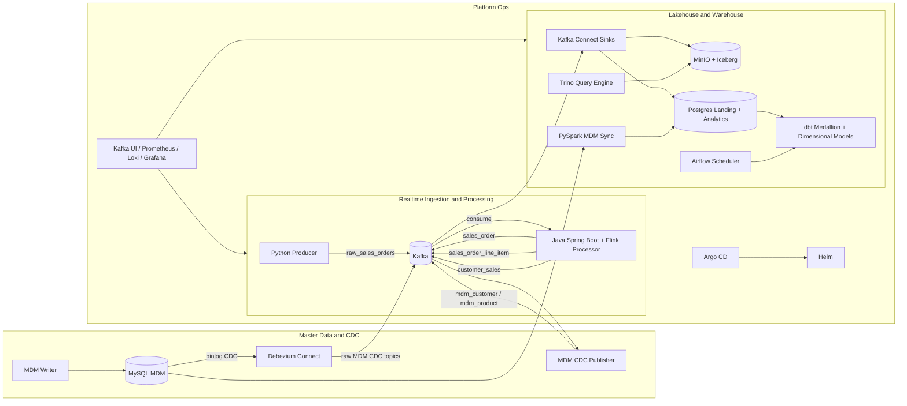

# Architecture Reference

This document is the canonical architecture reference for this project. It organizes the platform as a modern data architecture that combines batch and streaming, ELT modeling, lakehouse storage, and GitOps deployment automation.

## Purpose

This section defines the purpose of this document.
Define the canonical architecture, principles, and technology choices for this platform.

## Commands

This section defines the primary commands for this document.
Use the architecture-to-operations mapping in this document to choose the correct Make targets and deployment flows.

## Validation

This section defines the primary validation approach for this document.
Use the validation-oriented sections and mapped operational checks to confirm architecture behavior in local environments.

## Troubleshooting

This section defines the primary troubleshooting approach for this document.
Use architecture notes in this document to diagnose design-level issues, then use the runbook for step-by-step remediation.

## References

This section defines the primary cross-references for this document.

- [../README.md](../README.md)
- [runbook.md](runbook.md)
- [adr/README.md](adr/README.md)

## Documentation Map

- Project entrypoint: [../README.md](../README.md)
- Operations runbook: [runbook.md](runbook.md)
- Architecture Decision Records (ADR): [adr/README.md](adr/README.md)

## 1. Purpose and Scope

This platform demonstrates how to build a full-stack modern data system with these goals:

- Capture and process real-time events with Kafka and Flink.
- Persist data in a lakehouse pattern using S3-compatible object storage locally, with a path to true Iceberg tables and SQL querying, and in an analytics warehouse pattern (Postgres used to mimic Snowflake-like warehouse behavior).
- Apply ELT transformations with dbt using medallion layers (bronze, silver, gold).
- Incorporate dimensional modeling for analytics consumption.
- Run services in containers (Docker) and orchestrate on Kubernetes.
- Support polyglot engineering using Java and Python.
- Automate deployment through Helm (release packaging) and Argo CD (GitOps reconciliation).
- Keep the architecture portable so the analytics lakehouse/warehouse target can be Postgres (local demo), Redshift, Snowflake, BigQuery, or Databricks.

Out of scope for this demo:

- Cloud-managed production hardening (fully managed Kafka, managed object storage, enterprise IAM).
- Regulatory controls and enterprise governance implementation details.

## 2. Architectural Principles

- Event-driven first:
  Domain changes are emitted as immutable events to Kafka.
- Separation of concerns:
  Ingestion, stream processing, storage, and transformation are independently deployable components.
- ELT over ETL:
  Raw/landing data is loaded first, then transformed in the warehouse/lakehouse layer with dbt.
- Streaming plus batch unification:
  Streaming outputs are continuously available while batch-style analytics models are refreshed on schedule.
- Declarative operations:
  Helm values and Argo CD manifests drive environment consistency.
- Progressive environment promotion:
  Same topology across dev, qa, and prd with environment overlays.

## 3. Technology Mapping

| Capability | Technology in this project | Role |
| --- | --- | --- |
| Realtime event backbone | Kafka | Durable event transport, fan-out, and replay |
| Realtime stream compute | Flink (embedded in Spring Boot processor) | Event decomposition and transformation |
| Additional compute/sync | PySpark | MDM table synchronization to analytics landing |
| Warehouse simulation | Postgres | Mimics Snowflake-style SQL analytics target for local development |
| Lakehouse storage | MinIO | Local S3-compatible object storage for lakehouse data |
| Query engine | Trino | Interactive SQL layer for Iceberg-compatible tables on MinIO |
| Cloud warehouse/lakehouse targets (optional) | Redshift / Snowflake / BigQuery / Databricks | Production-grade alternatives using the same ELT and dimensional-modeling patterns |
| ELT modeling | dbt | Bronze/silver/gold SQL transformations and dimensional model materialization |
| CDC for master data | Debezium + MySQL | Capture and stream row-level changes |
| Orchestration | Airflow | Scheduled dbt execution |
| Container runtime | Docker / Docker Compose | Local service packaging and fast inner-loop execution |
| Container orchestration | Kubernetes (kind locally) | Cluster-style deployment and parity testing |
| Release packaging | Helm | Templated, versioned deployment definitions |
| GitOps delivery | Argo CD | Continuous reconciliation from Git to cluster |
| Programming languages | Java + Python | Java for stream processor, Python for producers/integration/sync services |

MinIO portability note:

- MinIO is the local S3-compatible object storage layer in this project.
- For cloud migration, replace MinIO with Amazon S3 (AWS), Google Cloud Storage (GCP), or Azure Data Lake Storage Gen2 (Azure).

Current state note:

- The current Kafka Connect path writes raw JSON objects to MinIO through the S3 sink connector.
- Trino is added as the query engine foundation, and this repository now includes a Trino-managed path to create real Iceberg tables on MinIO from Postgres landing data.
- This repository also includes a direct Kafka-to-Iceberg writer path that consumes streaming topics and writes Iceberg tables through Trino.

### 3.1 Concrete Migration Matrix (Connectors + dbt + Config)

The table below shows concrete deltas required to migrate from the default local setup (Postgres + MinIO) to each target platform.

| Target platform | Kafka/ingestion connector changes | dbt adapter changes | Core config changes | Notes |
| --- | --- | --- | --- | --- |
| Redshift | Replace JDBC sink to Postgres with either Redshift Sink connector or S3 staging plus COPY pipeline into Redshift | Use `dbt-redshift` and a `target: redshift` profile | Set `host`, `port`, `dbname`, `user`, `password`, `schema`; tune dist/sort keys and COPY IAM permissions | Best for teams already on AWS analytics stack |
| Snowflake | Replace JDBC sink with Snowflake Kafka Connector (Snowpipe Streaming or staged loads) | Use `dbt-snowflake` and a `target: snowflake` profile | Set `account`, `user`, `password` or key-pair auth, `role`, `warehouse`, `database`, `schema` | Keep medallion layers as schemas or databases per environment |
| BigQuery | Replace JDBC sink with BigQuery Sink connector | Use `dbt-bigquery` and a `target: bigquery` profile | Set service account auth, `project`, `dataset`, `location`, `method` (oauth/service-account) | Partition and clustering should be configured for fact models |
| Databricks | Replace JDBC sink with Delta Lake sink pattern (Kafka Connect Delta sink or cloud object sink consumed by Databricks) | Use `dbt-databricks` and a `target: databricks` profile | Set `host`, `http_path`, `token`, `catalog`, `schema`; configure Unity Catalog and cluster/SQL warehouse access | Keep Iceberg/Delta table governance consistent with medallion model intent |

Recommended migration workflow:

1. Keep topic names, event contracts, and dbt model semantics unchanged.
2. Switch connector layer and warehouse credentials by environment values.
3. Switch dbt adapter + profile target and run `dbt deps` and `dbt run` in lower environment.
4. Validate row counts and key dimensions/facts parity before promoting.

Local Trino materialization note:

- In this repository, real Iceberg tables can be created immediately by Trino from the existing Postgres `landing` schema.
- This is a pragmatic local bridge that now coexists with a direct Kafka-to-Iceberg writer path.

### 3.2 Sample dbt Profile Templates by Platform

The snippets below are example `profiles.yml` templates for each target platform. They use environment variables so credentials are not hardcoded.

#### Redshift (`dbt-redshift`)

```yaml
analytics:
  target: redshift
  outputs:
    redshift:
      type: redshift
      host: "{{ env_var('DBT_REDSHIFT_HOST') }}"
      port: 5439
      user: "{{ env_var('DBT_REDSHIFT_USER') }}"
      password: "{{ env_var('DBT_REDSHIFT_PASSWORD') }}"
      dbname: "{{ env_var('DBT_REDSHIFT_DB') }}"
      schema: "{{ env_var('DBT_REDSHIFT_SCHEMA', 'landing') }}"
      threads: 4
      sslmode: prefer
```

#### Snowflake (`dbt-snowflake`)

```yaml
analytics:
  target: snowflake
  outputs:
    snowflake:
      type: snowflake
      account: "{{ env_var('DBT_SNOWFLAKE_ACCOUNT') }}"
      user: "{{ env_var('DBT_SNOWFLAKE_USER') }}"
      password: "{{ env_var('DBT_SNOWFLAKE_PASSWORD') }}"
      role: "{{ env_var('DBT_SNOWFLAKE_ROLE', 'TRANSFORMER') }}"
      warehouse: "{{ env_var('DBT_SNOWFLAKE_WAREHOUSE') }}"
      database: "{{ env_var('DBT_SNOWFLAKE_DATABASE') }}"
      schema: "{{ env_var('DBT_SNOWFLAKE_SCHEMA', 'landing') }}"
      threads: 4
      client_session_keep_alive: false
```

#### BigQuery (`dbt-bigquery`)

```yaml
analytics:
  target: bigquery
  outputs:
    bigquery:
      type: bigquery
      method: service-account
      project: "{{ env_var('DBT_BIGQUERY_PROJECT') }}"
      dataset: "{{ env_var('DBT_BIGQUERY_DATASET', 'landing') }}"
      location: "{{ env_var('DBT_BIGQUERY_LOCATION', 'US') }}"
      keyfile: "{{ env_var('DBT_BIGQUERY_KEYFILE') }}"
      threads: 4
      timeout_seconds: 300
```

#### Databricks (`dbt-databricks`)

```yaml
analytics:
  target: databricks
  outputs:
    databricks:
      type: databricks
      host: "{{ env_var('DBT_DATABRICKS_HOST') }}"
      http_path: "{{ env_var('DBT_DATABRICKS_HTTP_PATH') }}"
      token: "{{ env_var('DBT_DATABRICKS_TOKEN') }}"
      catalog: "{{ env_var('DBT_DATABRICKS_CATALOG', 'main') }}"
      schema: "{{ env_var('DBT_DATABRICKS_SCHEMA', 'landing') }}"
      threads: 4
```

Template usage notes:

1. Keep one profile name (for example `analytics`) across all platforms to avoid changing `dbt_project.yml`.
2. Change only `target` and environment variables per environment (`dev`, `qa`, `prd`).
3. Install the matching adapter package in the dbt runtime image (`dbt-redshift`, `dbt-snowflake`, `dbt-bigquery`, or `dbt-databricks`).
4. Run `dbt debug` before `dbt run` after any platform switch.

### 3.3 Sample Environment Variable Blocks (.env Style)

Use these blocks as onboarding starters. They map directly to the profile templates above.

#### Redshift example

```dotenv
DBT_REDSHIFT_HOST=example-cluster.abc123.us-east-1.redshift.amazonaws.com
DBT_REDSHIFT_USER=analytics_user
DBT_REDSHIFT_PASSWORD=change_me
DBT_REDSHIFT_DB=analytics
DBT_REDSHIFT_SCHEMA=landing
```

#### Snowflake example

```dotenv
DBT_SNOWFLAKE_ACCOUNT=xy12345.us-east-1
DBT_SNOWFLAKE_USER=analytics_user
DBT_SNOWFLAKE_PASSWORD=change_me
DBT_SNOWFLAKE_ROLE=TRANSFORMER
DBT_SNOWFLAKE_WAREHOUSE=COMPUTE_WH
DBT_SNOWFLAKE_DATABASE=ANALYTICS
DBT_SNOWFLAKE_SCHEMA=LANDING
```

#### BigQuery example

```dotenv
DBT_BIGQUERY_PROJECT=my-gcp-project
DBT_BIGQUERY_DATASET=landing
DBT_BIGQUERY_LOCATION=US
DBT_BIGQUERY_KEYFILE=/secrets/gcp-service-account.json
```

#### Databricks example

```dotenv
DBT_DATABRICKS_HOST=dbc-12345678-aaaa.cloud.databricks.com
DBT_DATABRICKS_HTTP_PATH=/sql/1.0/warehouses/abc123def456
DBT_DATABRICKS_TOKEN=change_me
DBT_DATABRICKS_CATALOG=main
DBT_DATABRICKS_SCHEMA=landing
```

Environment variable handling guidelines:

1. Do not commit real secrets to Git.
2. Use secret stores (for example Kubernetes Secrets, cloud secret managers, or CI protected variables).
3. Keep variable names consistent across `dev`, `qa`, and `prd` to simplify deployment automation.
4. Validate connectivity in CI with `dbt debug` before running transformations.

## 4. Logical Architecture Overview



## 5. End-to-End Data Flow

### 5.1 Realtime Sales Domain Flow

1. Python producer publishes composite sales events to `raw_sales_orders`.
2. Java/Flink processor consumes raw events and fans out normalized streams:
   - `sales_order`
   - `sales_order_line_item`
   - `customer_sales`
3. Kafka Connect sinks these streams to raw JSON objects in MinIO and to Postgres `landing` schema tables.
4. Trino can materialize and query MinIO-backed Iceberg tables from the Postgres `landing` schema.
5. A direct Kafka-to-Iceberg writer can populate `lakehouse.streaming` tables without the Postgres bridge.
6. dbt models build medallion layers and dimensional outputs in Postgres.

### 5.2 Master Data (MDM) Flow

1. MDM writer upserts `customer360` and `product_master` entities into MySQL.
2. Debezium captures MySQL binlog changes and emits raw CDC topics.
3. CDC publisher normalizes/curates CDC records into analytics-friendly topics (`mdm_customer`, `mdm_product`).
4. PySpark sync job loads MySQL MDM tables into Postgres landing MDM tables.
5. dbt joins transactional and MDM data to build conformed dimensions and facts.

## 6. ELT and Medallion Design

This implementation follows ELT with medallion-style layers:

- `landing`:
  Raw ingested tables from Kafka Connect and PySpark sync.
- `bronze`:
  Lightweight standardization and source-aligned staging models.
- `silver`:
  Cleaned, conformed dimensions and facts for trusted analytical use.
- `gold`:
  Business-facing aggregates and summary outputs.

ELT rationale:

- Keep ingestion simple and resilient.
- Centralize transformation logic in version-controlled dbt SQL.
- Support lineage, testing, and repeatable model builds.

## 7. Dimensional Modeling in the Lakehouse/Warehouse

The silver and gold layers implement dimensional analytics patterns:

- Conformed dimensions:
  - `dim_mdm_customer`
  - `dim_mdm_product`
  - `dim_mdm_date`
- Transactional fact table:
  - `fact_sales_order`
- Business presentation table:
  - `gold_customer_sales_summary`

Modeling benefits:

- Simplifies BI query logic.
- Improves join consistency through conformed keys and attributes.
- Supports both operational reporting and higher-level KPI summary views.

## 8. Deployment and Runtime Topology

### 8.1 Local Development Runtime (Docker Compose)

- Primary objective: rapid local feedback loop.
- Includes producer, processor, Kafka, Kafka Connect, MinIO, Trino, MDM services, Postgres, dbt bootstrap job, and Airflow.
- One-shot init jobs (topic init, connector registration, bucket creation, dbt run) support idempotent startup.

### 8.2 Kubernetes Runtime (kind + Helm + Argo CD)

- Primary objective: GitOps-style deployment parity and environment promotion practice.
- Helm chart templates the full application stack.
- Argo CD continuously syncs desired state from Git.
- Environment values (`dev`, `qa`, `prd`) drive differences such as image references, broker endpoints, and scaling.
- Trino can be enabled as the lakehouse SQL endpoint for MinIO-backed Iceberg-compatible datasets.

### 8.3 Cloud Kubernetes Migration Candidates

The local Kubernetes model (kind + Helm + Argo CD) is designed to migrate cleanly to managed Kubernetes on major clouds.

Object storage mapping principle:

- Keep Iceberg table layout and medallion semantics unchanged, and swap only the object storage endpoint and credentials per cloud.

| Cloud | Kubernetes target | Recommended migration candidates | Notes |
| --- | --- | --- | --- |
| AWS | EKS | Kafka on MSK or Strimzi, object storage on S3, analytics target on Redshift, observability on Amazon Managed Prometheus/Grafana | Best fit when using Redshift and AWS-native IAM/networking |
| GCP | GKE | Kafka on Confluent/GKE deployment, object storage on GCS, analytics target on BigQuery, observability on Cloud Monitoring + Managed Service for Prometheus | Best fit when BigQuery is primary warehouse target |
| Azure | AKS | Kafka on Confluent/AKS deployment, object storage on ADLS Gen2, analytics target on Databricks or Synapse, observability on Azure Monitor managed Prometheus/Grafana | Best fit for Databricks-first lakehouse and Azure enterprise controls |

Cloud migration checklist:

1. Replace local stateful services (Kafka, Postgres, MinIO) with managed equivalents per cloud.
2. Move credentials from local env files to cloud secret managers.
3. Parameterize Helm values per cloud environment and keep Argo CD as reconciliation layer.
4. Re-run migration matrix validation (connector + dbt adapter + parity checks) before production cutover.

### 8.4 Make Target Map (Architecture to Operations)

Use this quick map to connect architecture responsibilities in this document to executable commands in [docs/runbook.md](docs/runbook.md) and [Makefile](../Makefile).

| Architecture responsibility | Primary routine | Make target(s) |
| --- | --- | --- |
| Bring up local runtime services | Routine A (Docker Compose) | `make up`, `make lakehouse-up` |
| Validate realtime and lakehouse data flow | Routine A (Docker Compose) | `make topics-check`, `make iceberg-streaming-smoke` |
| Run ELT transformations | Routine A (Docker Compose) | `make dbt-run`, `make verify-warehouse`, `make verify-dbt-relations` |
| Operate Airflow-driven dbt scheduling | Routine A (Docker Compose) | `make airflow-up`, `make airflow-trigger-dbt-dag`, `make airflow-dbt-reboot` |
| Run day-2 unified local operations | Routine A (Docker Compose) | `make routine-a-ops` |
| Bootstrap GitOps-style local cluster | Routine B (kind + Helm + Argo CD) | `make routine-b`, `make routine-b-argocd` |
| Recover missing Argo CD app object | Routine B (kind + Helm + Argo CD) | `kubectl apply -f argocd/dev.yaml`, `kubectl -n argocd get application realtime-dev` |
| Run day-2 unified cluster operations | Routine B (kind + Helm + Argo CD) | `make routine-b-ops` |
| Validate cluster health and app rollout | Routine B (kind + Helm + Argo CD) | `make ops-status-dev`, `make helm-health-dev`, `make airflow-dbt-check-dev`, `make mdm-topics-check-dev`, `make trino-smoke-dev`, `make iceberg-streaming-smoke-dev` |
| Access cluster web operational surfaces | Routine B (kind + Helm + Argo CD) | `kubectl -n argocd port-forward svc/argocd-server 8443:443`, `kubectl -n realtime-dev port-forward svc/realtime-dev-realtime-app-kafka-ui 8082:8080`, `kubectl -n realtime-dev port-forward svc/realtime-dev-realtime-app-grafana 3001:3000`, `kubectl -n realtime-dev port-forward svc/realtime-dev-realtime-app-airflow 8084:8080`, `kubectl -n realtime-dev port-forward svc/realtime-dev-realtime-app-minio 9001:9001`, `kubectl -n realtime-dev port-forward svc/realtime-dev-realtime-app-trino 8086:8080` |

Cross-reference note:

- Architecture rationale stays in this document.
- Step-by-step operator procedure stays in [docs/runbook.md](docs/runbook.md).
- Command implementation source of truth stays in [Makefile](../Makefile).

## 9. CI/CD and GitOps Design

- Source of truth:
  Git repository stores chart templates, environment values, and Argo CD applications.
- Delivery mechanism:
  Helm packages manifests; Argo CD reconciles cluster state to Git state.
- Promotion strategy:
  `dev -> qa -> prd` by controlled values/manifests progression.
- Operational safety:
  Health checks, logs, and validation scripts are used before promotion.

## 10. Non-Functional Considerations

### 10.1 Scalability

- Kafka partitions and consumer groups provide horizontal scaling for event processing.
- Flink topology can scale by task parallelism.
- dbt models can evolve to incremental patterns for larger volumes.

### 10.2 Reliability

- Durable Kafka topics allow replay and recovery.
- CDC stream preserves data-change history from master data source.
- Idempotent bootstrap/init jobs reduce operational fragility.

### 10.3 Observability

- Kafka UI for topic inspection.
- Prometheus/Loki/Grafana stack for metrics and logs in Kubernetes mode.
- Runbook-driven checks for pipeline health and model outputs.

### 10.4 Security (Demo vs Production)

Current local setup favors simplicity. Production hardening should include:

- Centralized secret management.
- TLS and authenticated Kafka client/broker traffic.
- Role-based access control for data stores and runtime services.

## 11. Architecture Decisions Summary

- Postgres is intentionally used as a local warehouse analog to mimic Snowflake-like SQL analytics workflows.
- The same architecture can target Redshift, Snowflake, BigQuery, or Databricks with adapter/profile and sink-integration changes rather than full redesign.
- Kafka plus Flink provides real-time event decomposition and processing.
- MinIO plus Trino now supports both a Trino-managed bridge from Postgres landing and a direct Kafka-to-Iceberg writer path for realtime lakehouse ingestion.
- dbt enforces ELT and medallion layer conventions with version-controlled SQL models.
- PySpark and Debezium integrate master data and CDC into analytical flows.
- Docker/Compose supports local speed; Kubernetes/Helm/Argo CD supports GitOps reproducibility.
- Java and Python are both first-class implementation languages based on service responsibilities.

## 12. Future Enhancements

- Add Schema Registry and compatibility enforcement for Kafka topics.
- Increase dbt test coverage (uniqueness, referential integrity, freshness).
- Introduce data lineage metadata and alerting.
- Externalize secrets and integrate enterprise identity controls.
- Add performance test suites for streaming and transformation workloads.
