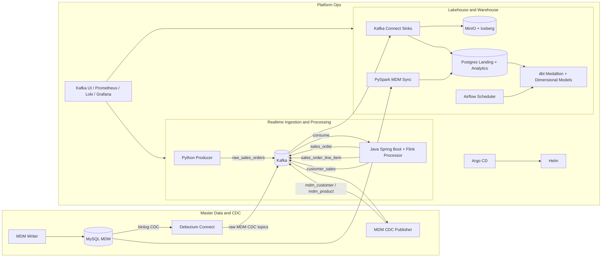

# Architecture Design

This document is the canonical architecture reference for this project. It organizes the platform as a modern data architecture that combines batch and streaming, ELT modeling, lakehouse storage, and GitOps deployment automation.

## 1. Purpose and Scope

This platform demonstrates how to build a full-stack modern data system with these goals:

- Capture and process real-time events with Kafka and Flink.
- Persist data in a lakehouse pattern (Iceberg on object storage) and in an analytics warehouse pattern (Postgres used to mimic Snowflake-like warehouse behavior).
- Apply ELT transformations with dbt using medallion layers (bronze, silver, gold).
- Incorporate dimensional modeling for analytics consumption.
- Run services in containers (Docker) and orchestrate on Kubernetes.
- Support polyglot engineering using Java and Python.
- Automate deployment through Helm (release packaging) and Argo CD (GitOps reconciliation).

Out of scope for this demo:

- Cloud-managed production hardening (fully managed Kafka, managed object storage, enterprise IAM).
- Regulatory controls and enterprise governance implementation details.

## 2. Architectural Principles

- Event-driven first:
  Domain changes are emitted as immutable events to Kafka.
- Separation of concerns:
  Ingestion, stream processing, storage, and transformation are independently deployable components.
- ELT over ETL:
  Raw/landing data is loaded first, then transformed in the warehouse/lakehouse layer with dbt.
- Streaming plus batch unification:
  Streaming outputs are continuously available while batch-style analytics models are refreshed on schedule.
- Declarative operations:
  Helm values and Argo CD manifests drive environment consistency.
- Progressive environment promotion:
  Same topology across dev, qa, and prd with environment overlays.

## 3. Technology Mapping

| Capability | Technology in this project | Role |
| --- | --- | --- |
| Realtime event backbone | Kafka | Durable event transport, fan-out, and replay |
| Realtime stream compute | Flink (embedded in Spring Boot processor) | Event decomposition and transformation |
| Additional compute/sync | PySpark | MDM table synchronization to analytics landing |
| Warehouse simulation | Postgres | Mimics Snowflake-style SQL analytics target for local development |
| Lakehouse storage | Iceberg tables on MinIO | Open table format on object storage |
| ELT modeling | dbt | Bronze/silver/gold SQL transformations and dimensional model materialization |
| CDC for master data | Debezium + MySQL | Capture and stream row-level changes |
| Orchestration | Airflow | Scheduled dbt execution |
| Container runtime | Docker / Docker Compose | Local service packaging and fast inner-loop execution |
| Container orchestration | Kubernetes (kind locally) | Cluster-style deployment and parity testing |
| Release packaging | Helm | Templated, versioned deployment definitions |
| GitOps delivery | Argo CD | Continuous reconciliation from Git to cluster |
| Programming languages | Java + Python | Java for stream processor, Python for producers/integration/sync services |

## 4. Logical Architecture Overview

## 5. End-to-End Data Flow

### 5.1 Realtime Sales Domain Flow

1. Python producer publishes composite sales events to `raw_sales_orders`.
2. Java/Flink processor consumes raw events and fans out normalized streams:
   - `sales_order`
   - `sales_order_line_item`
   - `customer_sales`
3. Kafka Connect sinks these streams to:
   - Iceberg tables in MinIO (lakehouse storage)
   - Postgres `landing` schema tables (warehouse-style landing)
4. dbt models build medallion layers and dimensional outputs in Postgres.

### 5.2 Master Data (MDM) Flow

1. MDM writer upserts `customer360` and `product_master` entities into MySQL.
2. Debezium captures MySQL binlog changes and emits raw CDC topics.
3. CDC publisher normalizes/curates CDC records into analytics-friendly topics (`mdm_customer`, `mdm_product`).
4. PySpark sync job loads MySQL MDM tables into Postgres landing MDM tables.
5. dbt joins transactional and MDM data to build conformed dimensions and facts.

## 6. ELT and Medallion Design

This implementation follows ELT with medallion-style layers:

- `landing`:
  Raw ingested tables from Kafka Connect and PySpark sync.
- `bronze`:
  Lightweight standardization and source-aligned staging models.
- `silver`:
  Cleaned, conformed dimensions and facts for trusted analytical use.
- `gold`:
  Business-facing aggregates and summary outputs.

ELT rationale:

- Keep ingestion simple and resilient.
- Centralize transformation logic in version-controlled dbt SQL.
- Support lineage, testing, and repeatable model builds.

## 7. Dimensional Modeling in the Lakehouse/Warehouse

The silver and gold layers implement dimensional analytics patterns:

- Conformed dimensions:
  - `dim_mdm_customer`
  - `dim_mdm_product`
  - `dim_mdm_date`
- Transactional fact table:
  - `fact_sales_order`
- Business presentation table:
  - `gold_customer_sales_summary`

Modeling benefits:

- Simplifies BI query logic.
- Improves join consistency through conformed keys and attributes.
- Supports both operational reporting and higher-level KPI summary views.

## 8. Deployment and Runtime Topology

### 8.1 Local Development Runtime (Docker Compose)

- Primary objective: rapid local feedback loop.
- Includes producer, processor, Kafka, Kafka Connect, MDM services, MinIO, Postgres, dbt bootstrap job, and Airflow.
- One-shot init jobs (topic init, connector registration, bucket creation, dbt run) support idempotent startup.

### 8.2 Kubernetes Runtime (kind + Helm + Argo CD)

- Primary objective: GitOps-style deployment parity and environment promotion practice.
- Helm chart templates the full application stack.
- Argo CD continuously syncs desired state from Git.
- Environment values (`dev`, `qa`, `prd`) drive differences such as image references, broker endpoints, and scaling.

## 9. CI/CD and GitOps Design

- Source of truth:
  Git repository stores chart templates, environment values, and Argo CD applications.
- Delivery mechanism:
  Helm packages manifests; Argo CD reconciles cluster state to Git state.
- Promotion strategy:
  `dev -> qa -> prd` by controlled values/manifests progression.
- Operational safety:
  Health checks, logs, and validation scripts are used before promotion.

## 10. Non-Functional Considerations

### 10.1 Scalability

- Kafka partitions and consumer groups provide horizontal scaling for event processing.
- Flink topology can scale by task parallelism.
- dbt models can evolve to incremental patterns for larger volumes.

### 10.2 Reliability

- Durable Kafka topics allow replay and recovery.
- CDC stream preserves data-change history from master data source.
- Idempotent bootstrap/init jobs reduce operational fragility.

### 10.3 Observability

- Kafka UI for topic inspection.
- Prometheus/Loki/Grafana stack for metrics and logs in Kubernetes mode.
- Runbook-driven checks for pipeline health and model outputs.

### 10.4 Security (Demo vs Production)

Current local setup favors simplicity. Production hardening should include:

- Centralized secret management.
- TLS and authenticated Kafka client/broker traffic.
- Role-based access control for data stores and runtime services.

## 11. Architecture Decisions Summary

- Postgres is intentionally used as a local warehouse analog to mimic Snowflake-like SQL analytics workflows.
- Kafka plus Flink provides real-time event decomposition and processing.
- Iceberg on MinIO demonstrates open lakehouse storage patterns.
- dbt enforces ELT and medallion layer conventions with version-controlled SQL models.
- PySpark and Debezium integrate master data and CDC into analytical flows.
- Docker/Compose supports local speed; Kubernetes/Helm/Argo CD supports GitOps reproducibility.
- Java and Python are both first-class implementation languages based on service responsibilities.

## 12. Future Enhancements

- Add Schema Registry and compatibility enforcement for Kafka topics.
- Increase dbt test coverage (uniqueness, referential integrity, freshness).
- Introduce data lineage metadata and alerting.
- Externalize secrets and integrate enterprise identity controls.
- Add performance test suites for streaming and transformation workloads.
